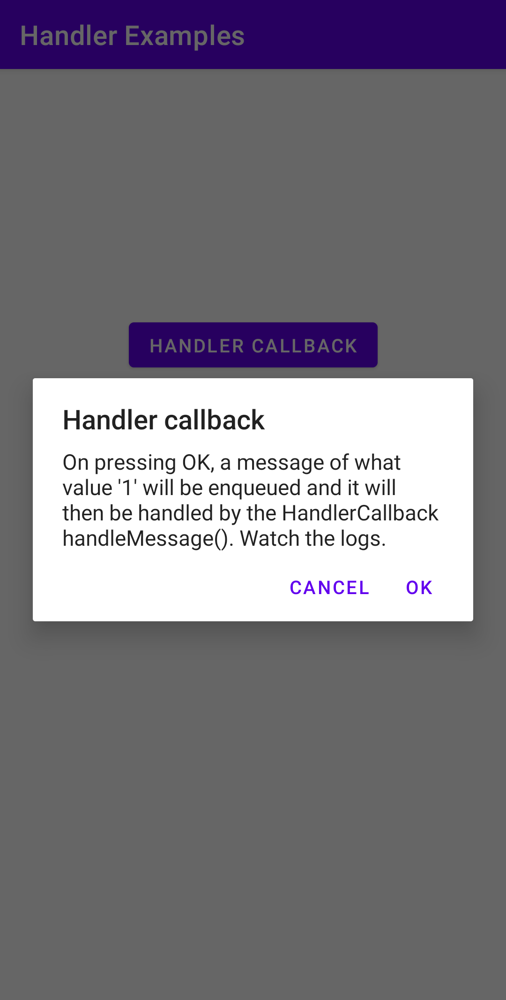
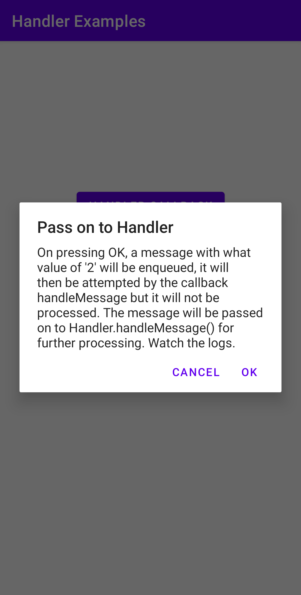
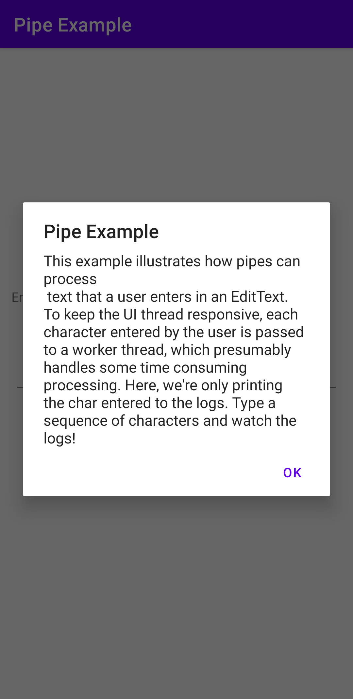
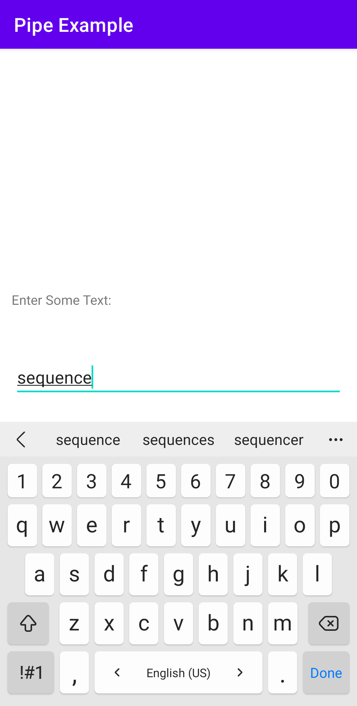
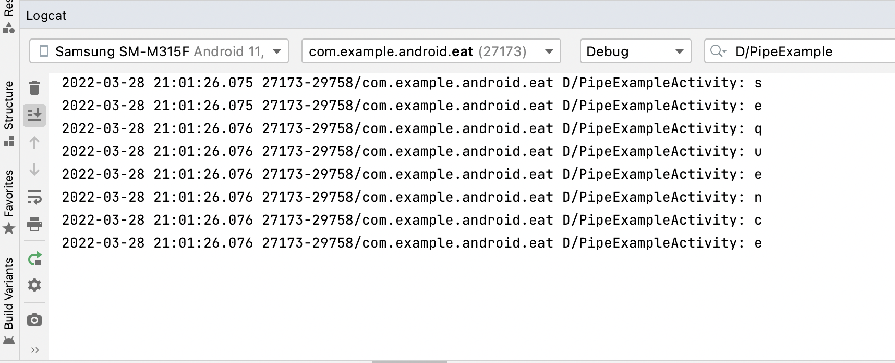

# EAT
The project name is an acronym for a textbook name, Efficient Android Threading.
This is a long term slow-paced project, intended for working out the examples 
included in the book. The output is mainly log messages. So it's mostly about
clicking some button, and watching the magic happens behind the scenes in the log
messages. Simple pop-up dialog boxes are included to explain the action and the
result to expect in the log messages.

The Book is available at [O'reilly](https://learning.oreilly.com/library/view/efficient-android-threading/9781449364120/).

    
